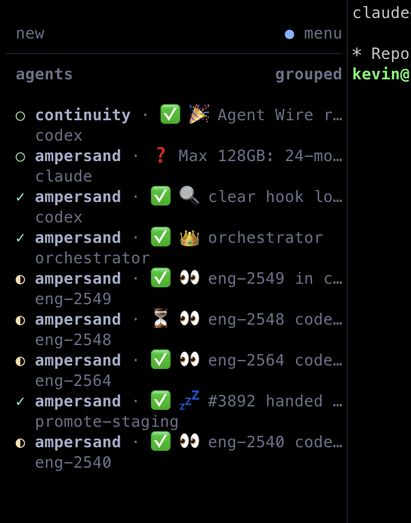

# Herdr customizations

**One orchestrator. Named workers. Questions that stay visible.**

My tab naming and orchestrator setup for [Herdr](https://github.com/herdrdev/herdr),
packaged as skills, small Python helpers, and lifecycle hooks for Claude Code
and Codex. The agents keep their native tools and sessions. The labels help me
see what they are doing and which ones need me.

I mainly talk to one orchestrator. It coordinates the workers and brings
decisions back to me. I reserve the crown for that agent so it is easy to
find in a busy workspace.

## What it looks like



*Screenshot from my working setup. Herdr's own sidebar indicators are
separate from the label prefixes added by these hooks.*

The tab labels follow **status + stage + short task**:

| Part | Example | Meaning |
| --- | --- | --- |
| Status | `⏳` | The agent is working |
| Stage | `👀` | It is reviewing |
| Task | `login fix` | The work this tab owns |
| Orchestrator | `👑 orchestrator` | The shared supervisor I mainly talk to |

Workers rename their tabs at milestones: investigating, building, testing,
reviewing, PR open, merged, or parked. The skill keeps the task and stage
current. Hooks update turn state and flag questions or permission requests.

| Prefix | Meaning in this customization |
| --- | --- |
| `⏳` | Working |
| `✅` | Turn finished, nothing needed from me |
| `⚪` | Ready, no active task |
| `❓` | I need to answer or decide |
| `❗` | I need to take an action |

A checkmark means a turn ended. Tests, review, and the actual result establish
whether a task is finished.

## Keep the question and the task

An agent can keep working while a question is pending. The label keeps
both parts:

```text
⏳ 🛠️ login fix
❓ ship today? · 🛠️ login fix
```

A turn ending leaves the question visible. My next message, or my answer
to a question dialog, clears it and the tab goes back to `⏳`.

## Why the hooks inject context

A skill that the agent has to remember to load doesn't get used. So the
Claude `SessionStart` hook tells every session to name its tab and how,
and each prompt carries a one-line reminder to flag asks before stopping.
The Codex helper does the same through its hook output.

## One orchestrator

Exactly one Claude session is the orchestrator. Its Herdr agent is named
`orchestrator` and its tab reads `👑 orchestrator`. Its session hook tells it
the role, and tells every other session to report to it.

- `herdr-orchestrator claim` makes the calling session the orchestrator.
- `herdr-orchestrator who` prints where it is.
- `herdr-orchestrator ensure` runs from the hooks. If the orchestrator is
  gone, it restarts it in its crowned tab, but never alongside a live one.
- `herdr-orchestrator next` hands the next queued brief to a `⚪ ready`
  Claude tab, or opens a new tab when there is enough free memory.

The orchestrator coordinates. It hands investigations, fixes and watching CI
to fresh sessions, and keeps its notes in
`~/.local/state/orchestrator/STATUS.md`.

## Set it up

Requirements: [Herdr](https://github.com/herdrdev/herdr) (checked with 0.9.1),
Python 3.11+, `jq`, and Claude Code or Codex running inside a Herdr pane.
Linux and macOS both work. Follow the [setup guide](docs/setup.md).

- [Claude skill](claude/skills/herdr/SKILL.md) and hooks:
  [herdr-tab](claude/hooks/herdr-tab), [herdr-orchestrator](claude/hooks/herdr-orchestrator)
- [Codex skill](codex/skills/herdr/SKILL.md) and
  [helper](codex/skills/herdr/scripts/herdr-tab.py)
- Hook examples for [Claude Code](hooks/claude-hooks.example.json) and
  [Codex](hooks/codex-hooks.example.json)

Hooks never approve permissions and fail open when Herdr is unavailable.
Conversations are cleared only after I approve the exact pane and session.

## Pair it with Agent Wire

I use [Agent Wire](https://github.com/kevinmanase/agent-wire) for a shared work
list and messages between Claude and Codex sessions. The orchestrator reads
that list to see what each session reports. The labels and hooks work without
it.

## Development

```sh
python3 -m venv .venv
.venv/bin/python -m pip install -r requirements-dev.txt
.venv/bin/python -m pytest -q
.venv/bin/ruff check .
.venv/bin/ruff format --check .
```

[The tests](tests/test_herdr.py) run the helpers against a
[fake Herdr](tests/fake_herdr.py), never live tabs.

## License

Copyright © 2026 Kevin Manase and contributors.

Herdr customizations is licensed under the
[GNU Affero General Public License, version 3 only](LICENSE)
(`AGPL-3.0-only`). The full license is included in this repository.
